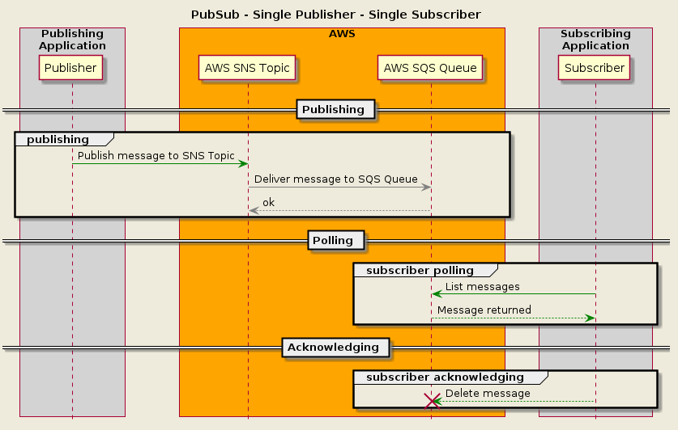

# Configuring JustSaying

## The publish-subscribe pattern
> In software architecture, publish–subscribe is a messaging pattern where senders of messages, called publishers, do not program the messages to be sent directly to specific receivers, called subscribers, but instead categorize published messages into classes without knowledge of which subscribers, if any, there may be. Similarly, subscribers express interest in one or more classes and only receive messages that are of interest, without knowledge of which publishers, if any, there are. [(Wikipedia)](https://en.wikipedia.org/wiki/Publish%E2%80%93subscribe_pattern)

# Configuring a single publisher and a single subscriber

## Configuring the publisher

- In this configuration the following AWS resources will be created
    - a SNS topic of name `orderplacedevent`
    - a SQS queue of name `orderplacedevent`
    - a SNS topic subscription for queue `orderplacedevent` to topic `orderplacedevent`

- In `Startup.cs` add the following
```cs
    services.AddJustSaying(bus =>
    {
        bus.Publications(publication =>
        {
            // Creates the SNS Topic
            publication.WithTopic<OrderPlacedEvent>();
        });
    }
```

## Configuring the subscriber

- In `Startup.cs` add the following
```cs
    services.AddJustSaying(bus =>
    {
        bus.Subscriptions(subscription =>
        {
            // Creates the SQS queue
            // Creates the SQS to SNS subscription
            subscription.ForTopic<OrderPlacedEvent>();
        });
    }
    // Add a handler responsible for handling the event
    services
        .AddJustSayingHandler<OrderPlacedEvent, OrderPlacedEventHandler>();

    // Add a background service that is listening for messages related to the above subscription
    services.AddHostedService<Subscriber>();
```

*Resulting infrastructure*



# Configuring a single publisher and a multiple subscribers

In this configuration, each of the two subscribers will have a dedicated queue that is subscribed to a single topic.

## Configuring the publisher

- In this configuration the following AWS resources will be created
    - a SNS topic of name `orderplacedevent`
    - a SQS queue of name `kitchen_orderplacedevent`
    - a SQS queue of name `marketing_orderplacedevent`
    - a SNS topic subscription for queue `kitchen_orderplacedevent` to topic `orderplacedevent`
    - a SNS topic subscription for queue `marketing_orderplacedevent` to topic `orderplacedevent`

- In `Startup.cs` add the following
```cs
    services.AddJustSaying(bus =>
    {
        bus.Publications(publication =>
        {
            // Creates the SNS Topic
            publication.WithTopic<OrderPlacedEvent>();
        });
    }
```

## Configuring the first subscriber

- In `Startup.cs` add the following
```cs
    services.AddJustSaying(bus =>
    {
        bus.Subscriptions(subscription =>
        {
            // Creates the SQS queue
            // Creates the SQS to SNS subscription
            subscription.ForTopic<OrderPlacedEvent>();
        });
    }
    // Add a handler responsible for handling the event
    services
        .AddJustSayingHandler<OrderPlacedEvent, OrderPlacedEventHandler>();

    // Add a background service that is listening for messages related to the above subscriptions
    services.AddHostedService<Subscriber>();
```

## Configuring the second subscriber

- In `Startup.cs` add the following
```cs
    services.AddJustSaying(bus =>
    {
        bus.Subscriptions(subscription =>
        {
            // Creates the SQS queue
            // creates the SQS to SNS subscription
            subscription.ForTopic<OrderPlacedEvent>();
        });
    }
    // Add a handler responsible for handling the event
    services
        .AddJustSayingHandler<OrderPlacedEvent, OrderPlacedEventHandler>();

    // Add a background service that is listening for messages related to the above subscriptions
    services.AddHostedService<Subscriber>();
```

